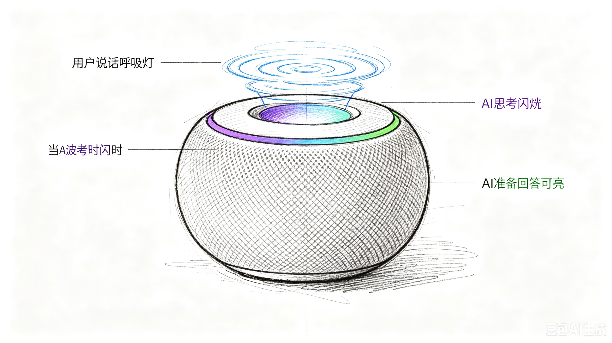

# lab-vad-breathing-light-mechanism
# Breathing Light Induction Mechanism for Solving VAD Interruption Conflict in Voice Interaction

This project is fully open for viewing, research, citation, secondary development and practical deployment.
本项目完全开放，欢迎自由查阅、研究、引用、二次开发与落地应用。

## External Links
- Zenodo (DOI: 10.5281/zenodo.20577952)
- OSF: https://osf.io/j4f5a/overview
- IPFS: https://ipfs.io/ipfs/bafkreie7nm7vqpkbofbkpspeh4j22ywwsnfagzz73vzg4uhgallugc5gdq

## Files
The folder contains the technical report in PDF format and the LaTeX file used for document typesetting.
仓库内包含技术报告PDF文件，以及用于文档排版的LaTeX源文件。

## Project Schematic Diagrams

)
)
)
)
)
